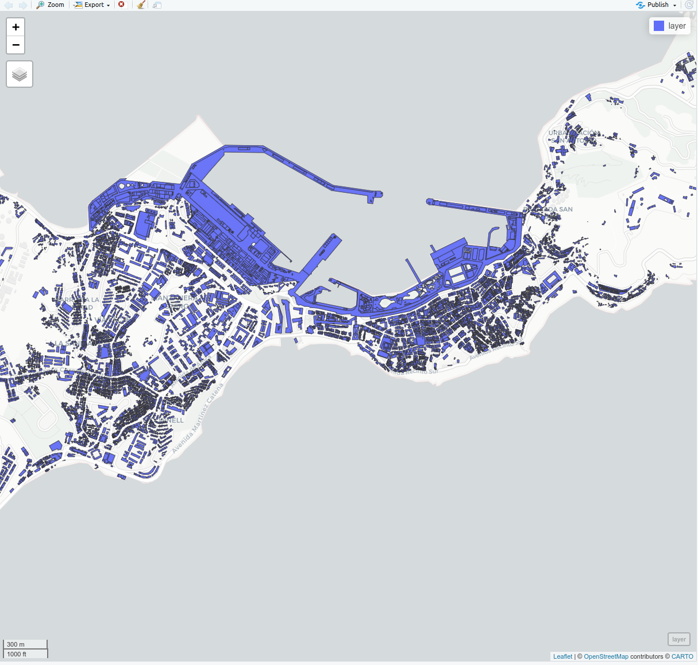

CatastroDownloader 0.1.1
================
2021-01-28

# Description

The goal of this library is to download the complete updated Catastro
layers for a Province of Spain. Main benefits:

  - Can be parallelized to download several Provinces at once. Moreover,
    it can be configured to receive a mobile notification when finished.
  - It merges all the municipalities in one file while keeping the
    minicipality name as an attribute in order to use it as filter later
    on.
  - It creates a single file in .gpkg format where 3 layers are stored:
      - buildings
      - buildingparts
      - otherconstructions
  - It stimates the building height for eacch of the polygons (given a
    height of floor above the ground).

# Installation

This packages has been tested in:

  - Ubuntu 20.04 with R 3.6.3
  - Windows 10 with R 4.0 + Rtools40

Install dependencies (libraries) in R:

``` r
# install libraries to install packages from github
install.packages("devtools"); library(devtools)

install_github("cesarkero/CatastroDownloader")
```

# Before try out

Please, use this library using your brain. Download just what you need
and avoid constant masive downloads as it will produce overload in
public servers and this can lead to restrictions for the general public.
So please, be kind with the service and let us all enjoy this data. For
sure, don’t try parallel for masive downloads until you have checked
that this is a useful tool to you.

Moreover, if you just need catastro for a single or a few
municipalities, just use the QGIS compelemnt [Spanish Inspire Catastral
Downloader](https://github.com/sigdeletras/Spanish_Inspire_Catastral_Downloader).

[](https://github.com/sigdeletras/Spanish_Inspire_Catastral_Downloader)

Enjoy.

-----

# Examples

## Single Province download

Get the list of available Provinces in the Catastro atom service:

``` r
library(CatastroDownloader)

# set parameters
catastropush <- "http://www.catastro.minhap.es/INSPIRE/buildings/ES.SDGC.bu.atom.xml"

# Catch Provinces Names in atom service
FeedProvinces(catastropush)
```

This is the list of provinces at 2021-01-28:

\[1\] “Albacete” “Alicante” “Almería” “Avila” “Badajoz” “Baleares”
“Barcelona” “Burgos” “Cáceres” “Cádiz”  
\[11\] “Castellón” “Ciudad Real” “Córdoba” “Coruña” “Cuenca” “Girona”
“Granada” “Guadalajara” “Huelva” “Huesca”  
\[21\] “Jaén” “León” “Lleida” “La Rioja” “Lugo” “Madrid” “Málaga”
“Murcia” “Ourense” “Oviedo”  
\[31\] “Palencia” “Palmas (Las)” “Pontevedra” “Salamanca” “S.C.
Tenerife” “Cantabria” “Segovia” “Sevilla” “Soria” “Tarragona”  
\[41\] “Teruel” “Toledo” “Valencia” “Valladolid” “Zamora” “Zaragoza”
“Cartagena” “Gijon” “Jerez Frontera” “Vigo”  
\[51\] “Ceuta” “Melilla”

If you just need to download the catastro for a single Province use
this:

``` r
# Set parameters 
catastropush <- "http://www.catastro.minhap.es/INSPIRE/buildings/ES.SDGC.bu.atom.xml" #url for the atom service
output <- "../00_Output/" #where the .gpkg file will be stored
tempdir <- "./temp/" #careful as all files inside will be removed
rpush = TRUE #if you want a notification when finished (RPushbullet must be configured before)
overwrite = TRUE #overwrite .gpkg if exists
Hfloor = 3 #set desired height for each floor above the ground

catastroprovince('Melilla', catastropush, tempdir, output, rpush = TRUE, overwrite = FALSE, Hfloor = 3)
```

<div class="figure" style="text-align: center">


<p class="caption">

Screenshots of generated files (.gpkg) for several excutions

</p>

</div>

To show some data within R

``` r
# show some data
file <- paste0(output, 'Catastro_Ceuta_2021-01-26.gpkg')
layer <- st_read(file, 'buildingpart')
mapview(layer)
```

<div class="figure" style="text-align: center">



<p class="caption">

Some example of buildingparts

</p>

</div>

## Parallel process for several Provinces

Parallel process allows to download a list of desired Provinces with
just one execution of the code. Must be taken into acount that there are
slight differences between the process within Linux and Windows.

### Parallel process for LINUX

``` r
# Set parameters 
catastropush <- "http://www.catastro.minhap.es/INSPIRE/buildings/ES.SDGC.bu.atom.xml" #url for the atom service
output <- "../00_Output/" #where the .gpkg file will be stored
tempdir <- "./temp/" #careful as all files inside will be removed
rpush = TRUE #if you want a notification when finished (RPushbullet must be configured before)
overwrite = TRUE #overwrite .gpkg if exists
ncores = 16 #specify number of cores dedicated
Hfloor = 3 #set desired height for each floor above the ground

# Set list of provinces to download
provinceslist <- c("Zamora", "Vigo")

# Set parallel
cl <- parallel::makeCluster(ncores, type="FORK")
doParallel::registerDoParallel(cl)

# Execute function
foreach(i=provinceslist) %dopar% {catastroprovince(i,catastropush, tempdir, output, rpush, overwrite, Hfloor)}

# Stop parallel 
stopCluster(cl)
```

### Parallel process for WINDOWS

``` r
# Set parameters 
catastropush <- "http://www.catastro.minhap.es/INSPIRE/buildings/ES.SDGC.bu.atom.xml" #url for the atom service
output <- "../00_Output/" #where the .gpkg file will be stored
tempdir <- "./temp/" #careful as all files inside will be removed
rpush = TRUE #if you want a notification when finished (RPushbullet must be configured before)
overwrite = TRUE #overwrite .gpkg if exists
ncores = 16 #specify number of cores dedicated
Hfloor = 3 #set desired height for each floor above the ground

# Set list of provinces to download
provinceslist <- c("Zamora", "Vigo")

# Set parallel
cl <- parallel::makeCluster(ncores, type="PSOCK")
doParallel::registerDoParallel(cl)
clusterEvalQ(cl, library("CatastroDownloader")) # load libraries
clusterExport(cl, c('catastropush', 'output', 'tempdir', 'ncores'))

# Execute function
foreach(i=provinceslist) %dopar% {catastroprovince(i,catastropush, tempdir, output, rpush, overwrite, Hfloor)}

# Stop parallel 
stopCluster(cl)
```

## Screenshots of the results

#### Notification

If you have previously configured
[rpushbullet](https://github.com/eddelbuettel/rpushbullet) you will get
a notification in your devices when the process in completed.

<p align="center">


</p>

#### Screenshot of Ceuta

<p align="center">


</p>

#### Detail of Ceuta

<p align="center">


</p>

#### Screenshot of Orense (somewhere)

<p align="center">


</p>

# Notes for the future:

  - May be a shiny app could be created (even using a selection with
    cursor both for Provinces and Municipalities)
  - Need of improvement in speed of execution (the most time consuming
    task is merging all the municipalities layers into one…) May be it
    could be parallelized internaly ? What would happend when the
    parallel process is also “outside”?
  - May be it is interesting to specified the desired CRS for the
    output.

-----

# Corrections:

  - When a province contains municipalities with different CRS’s, all
    the layers will be transformed into the most common CRS.
